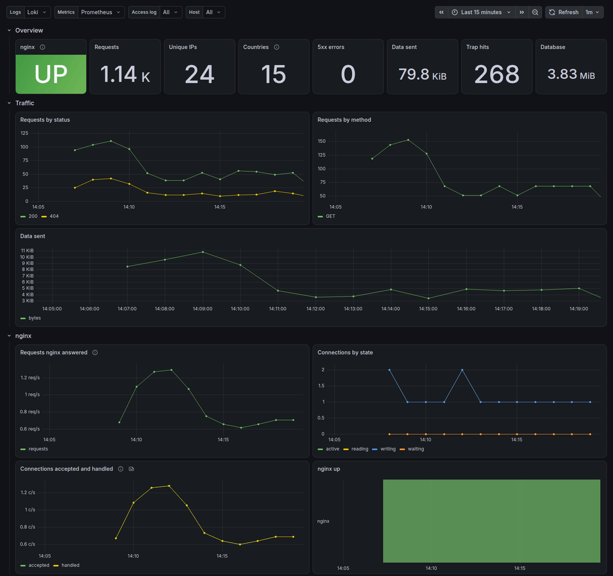
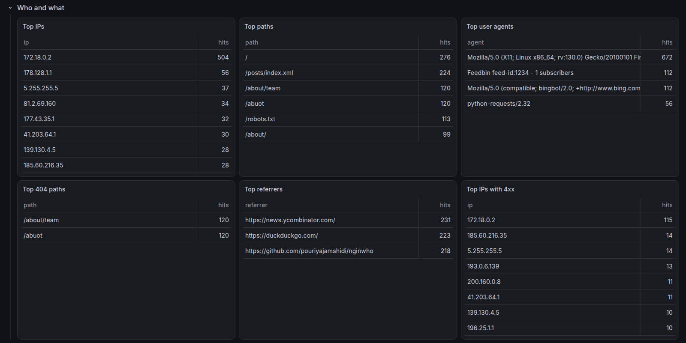
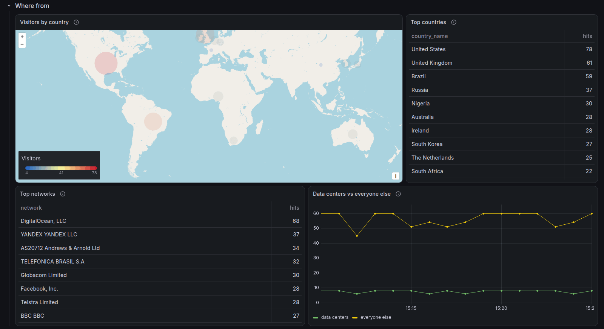
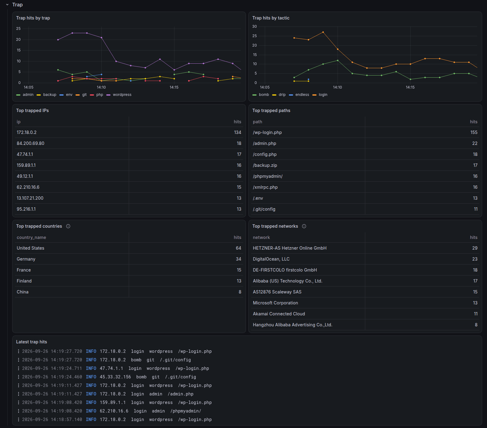
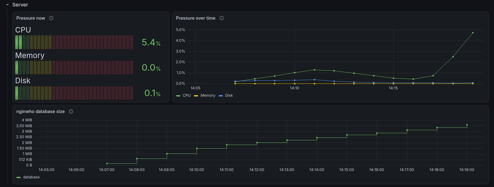
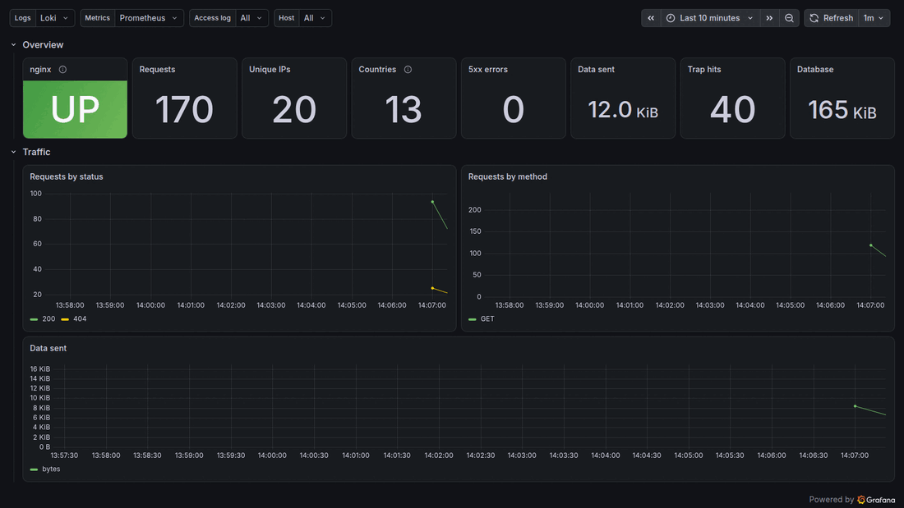

# nginwho on Grafana

Send your visitors, the trap's catches and your server's health to Grafana, and see them all
on one dashboard. It works with the free tier of Grafana Cloud.



You can try the whole thing on your own machine first, with Docker. Nothing is installed on
your system and one command removes it all.

## Table of contents

- [nginwho on Grafana](#nginwho-on-grafana)
  - [Table of contents](#table-of-contents)
  - [What you get](#what-you-get)
  - [Try it on your machine](#try-it-on-your-machine)
    - [Start it](#start-it)
    - [Look around](#look-around)
    - [Send your own requests](#send-your-own-requests)
    - [Stop and remove it](#stop-and-remove-it)
    - [How the test setup works](#how-the-test-setup-works)
  - [Set it up on your server](#set-it-up-on-your-server)
    - [1. Let Alloy see the database size](#1-let-alloy-see-the-database-size)
    - [2. Install Alloy and give it the config](#2-install-alloy-and-give-it-the-config)
    - [3. Get the country data](#3-get-the-country-data)
    - [4. nginx metrics (optional)](#4-nginx-metrics-optional)
    - [5. Import the dashboard](#5-import-the-dashboard)
    - [Check that it works](#check-that-it-works)
  - [More from the free tier](#more-from-the-free-tier)
  - [The files in this folder](#the-files-in-this-folder)

## What you get

[Grafana Alloy](https://grafana.com/docs/alloy/latest/) runs on your server, reads these and
sends them to Grafana:

| What                          | From                           | Shows up as               |
| ----------------------------- | ------------------------------ | ------------------------- |
| nginx's access log            | `/var/log/nginx/access.log`    | logs with `job="nginx"`   |
| nginwho's log, with `--serve` | `/var/log/nginwho/access.log`  | logs with `job="nginwho"` |
| nginwho's output, trap hits   | `/var/log/syslog`              | logs with `job="syslog"`  |
| The database size             | `/var/lib/nginwho/nginwho.db*` | `file_size_*` metrics     |
| nginx connections             | the nginx Prometheus exporter  | `nginx_*` metrics         |
| CPU, memory, disk, network    | Alloy's built-in node exporter | `node_*` metrics          |

Every visitor and trapped bot also gets its country and network, from the free
[ip66.dev](https://ip66.dev) database. You need no account or key for it.

The dashboard in `dashboard.json` shows:

- **Overview**: whether nginx is up, requests, unique visitors, countries, server errors, data
  sent, trap hits and the database size
- **Traffic**: requests by status and method, and data sent
- **nginx**: requests nginx answered, including the ones it handed to the trap, connections by
  state, connections accepted and handled, and whether nginx was up
- **Who and what**: top IPs, pages, user agents, missing pages, referrers and IPs that get
  errors
- **Where from**: a world map, top countries, top networks and how much traffic comes from
  data centers
- **Trap**: hits by trap and by what we did to the bot, top trapped IPs, paths, countries and
  networks, and the latest hits
- **Server**: how much programs wait for the CPU, memory, disk and interrupts, now and over
  time, and how the database grows
- **Logs**: the access log, live









## Try it on your machine

You need [Docker](https://docs.docker.com/get-docker/) with Compose, and the ports 3000, 8081,
8082 and 12345 free.

### Start it

From the root of this repository:

```bash
cd observability &&
docker compose up -d --build
```

The first start builds nginwho from this repository, so it takes a few minutes. After that a
script starts sending fake visitors and bots, and the dashboard fills up within a minute or
two.



### Look around

| What                    | Where                                    |
| ----------------------- | ---------------------------------------- |
| The dashboard           | <http://localhost:3000>, no login needed |
| Alloy's pipeline        | <http://localhost:12345>                 |
| The site behind nginx   | <http://localhost:8081>                  |
| The site nginwho serves | <http://localhost:8082>                  |

nginwho's report works too. It reads the same database as on a real server:

```bash
docker compose exec nginwho nginwho --report
```

To see where each file lives, look inside the containers. The paths are the same as on a real
server:

```bash
docker compose exec alloy ls -la /var/log /var/log/nginx /var/log/nginwho /var/lib/nginwho /var/lib/alloy &&
docker compose exec nginwho cat /etc/nginwho/nginwho.conf
```

To follow what nginwho and the traffic script are doing:

```bash
docker compose logs -f nginwho nginwho-serve
```

### Send your own requests

nginx in this setup takes the visitor IP from the `X-Forwarded-For` header, so you can pretend
to come from anywhere. For example, a visitor from the UK:

```bash
curl -H "X-Forwarded-For: 81.2.69.160" -A "Mozilla/5.0" http://localhost:8081/
```

A bot looking for secrets. The trap sends a fake `.env` one byte at a time, so stop after 5
seconds. Use an IP the traffic script doesn't, or you get what its bots get by now: a gzip bomb.

```bash
curl -m 5 -H "X-Forwarded-For: 188.166.1.1" -A "Mozilla/5.0" http://localhost:8081/.env
```

A fake login. The trap takes 10 to 30 seconds to say the password was wrong, and saves what
was typed after that. Then pick "Trap: credentials tried" in the report:

```bash
curl -m 5 -H "X-Forwarded-For: 188.166.1.1" -A "Mozilla/5.0" -d "log=admin&pwd=hunter2" http://localhost:8081/wp-login.php
```

The dashboard shows both within a minute, in "Latest trap hits", with the country (the
Netherlands) and network (DigitalOcean) in "Top trapped countries" and "Top trapped networks".

### Stop and remove it

This removes the containers, the data and the nginwho image it built:

```bash
docker compose down -v --rmi local
```

### How the test setup works

`compose.yaml` builds a small copy of a real server:

| Service          | What it does                                                                      |
| ---------------- | --------------------------------------------------------------------------------- |
| `nginx`          | Serves a test site and hands bots to the trap, like a real nginx setup            |
| `nginwho`        | Saves nginx's log in its database and runs the trap                               |
| `nginwho-serve`  | A second nginwho that serves the site itself with `--serve`                       |
| `nginx-exporter` | Turns nginx's `stub_status` page into metrics                                     |
| `geoip`          | Downloads the ip66.dev database once, like `ip66-update` does on a server         |
| `alloy`          | Runs `config.alloy` from this folder, unchanged                                   |
| `loki`           | Stores the logs, in place of Grafana Cloud                                        |
| `prometheus`     | Stores the metrics, in place of Grafana Cloud                                     |
| `grafana`        | Shows `dashboard.json` from this folder                                           |
| `traffic`        | Runs `test/traffic.sh`: people from 12 countries, feed readers, crawlers and bots |

A few things differ from a real server:

- nginx, nginwho, the exporter and Alloy share one network, so `127.0.0.1` means the same
  thing to all of them, as on one server.
- Alloy is given the local Loki and Prometheus addresses instead of Grafana Cloud's. That is
  the only change, the config file is the same.
- nginwho's output is written to `/var/log/syslog`, as rsyslog does on a real server.
- nginx trusts `X-Forwarded-For` from anyone, so the traffic script can pick the visitor IPs.
  Never do this on a real server, anyone could fake their IP.
- The site served by `nginwho-serve` only trusts a CDN's header for the visitor IP, so its
  visitors show up with Docker's own IP, like `172.18.0.3`, and no country.

## Set it up on your server

These steps are for Debian and Ubuntu, with nginwho already running as a service. Run them
from this folder.

### 1. Let Alloy see the database size

The `nginwho.service` in this repository lets other users see that the database exists,
while only root can read it. If yours has `StateDirectoryMode=0700`, update it:

```bash
sudo install -m 644 ../nginwho.service -D -t /etc/systemd/system/ &&
sudo systemctl daemon-reload &&
sudo systemctl restart nginwho
```

### 2. Install Alloy and give it the config

Install Alloy with [Grafana's guide](https://grafana.com/docs/alloy/latest/set-up/install/linux/).
Then copy the config and add your Grafana Cloud details to `/etc/default/alloy`, where Alloy
reads its settings from:

```bash
sudo cp config.alloy /etc/alloy/config.alloy &&
cat alloy.env | sudo tee -a /etc/default/alloy > /dev/null &&
sudoedit /etc/default/alloy
```

Fill in the five `GCLOUD_` lines at the end of the file. In Grafana Cloud, open your stack:

- **Loki > Details** has the logs URL and user (the `GCLOUD_HOSTED_LOGS_` values)
- **Prometheus > Details** has the metrics URL and user (the `GCLOUD_HOSTED_METRICS_` values)
- **Access Policies** makes the token (`GCLOUD_RW_API_KEY`). Give it `logs:write` and
  `metrics:write`

The token is a secret and this file can usually be read by every user, so let only root read
it. systemd reads it as root before it starts Alloy, so Alloy still gets the values:

```bash
sudo chmod 600 /etc/default/alloy
```

This keeps the token out of `config.alloy` too, so that file is safe to share or keep in git.

The server metrics are sent with `job="integrations/node_exporter"`, the name Grafana Cloud's
Linux dashboards look for. If your own panels use another job name, like `<host>-metrics`,
change them to this one.

nginwho's output reaches `/var/log/syslog` through rsyslog. Ubuntu has it, on Debian install
it with `sudo apt install rsyslog`.

### 3. Get the country data

`ip66-update` downloads the ip66.dev database and restarts Alloy. Run it once now and let
cron run it every week:

```bash
sudo install -m 755 ip66-update -D -t /etc/cron.weekly/ &&
sudo /etc/cron.weekly/ip66-update
```

The database has to be there before Alloy starts, so this step also starts Alloy with the new
config.

### 4. nginx metrics (optional)

Only the panels in the "nginx" row and the nginx tile need this. Add a status page that only the server
itself can reach, to your nginx config:

```nginx
server {
    listen 127.0.0.1:8080;
    access_log off;

    location = /stub_status {
        stub_status on;
    }
}
```

Then install the exporter and point it at the page:

```bash
sudo apt install prometheus-nginx-exporter &&
echo 'ARGS="--nginx.scrape-uri=http://127.0.0.1:8080/stub_status --web.listen-address=127.0.0.1:9113"' | sudo tee /etc/default/prometheus-nginx-exporter > /dev/null &&
sudo nginx -t &&
sudo systemctl reload nginx &&
sudo systemctl restart prometheus-nginx-exporter
```

### 5. Import the dashboard

In Grafana Cloud, go to **Dashboards > New > Import** and upload `dashboard.json`. It uses
your stack's Loki and Prometheus, named like `grafanacloud-<your stack>-logs` and
`grafanacloud-<your stack>-prom`. If you have more than one, pick them in the "Logs" and
"Metrics" menus at the top of the dashboard.

Only logs sent after this setup have countries, so the map fills up from now on.

### Check that it works

Alloy must be able to read the logs, which the `adm` group can. If one of these fails, the
matching panels stay empty:

```bash
sudo -u alloy head -1 /var/log/nginx/access.log &&
sudo -u alloy head -1 /var/log/syslog &&
sudo -u alloy ls /var/lib/nginwho > /dev/null &&
systemctl status alloy --no-pager
```

If reading a log fails, add Alloy to the group and restart it:

```bash
sudo usermod -aG adm alloy &&
sudo systemctl restart alloy
```

Alloy's own page shows each step of the pipeline and any errors. It only listens on the server
itself, so reach it over SSH:

```bash
ssh -L 12345:127.0.0.1:12345 your-server
```

Then open <http://localhost:12345>.

## More from the free tier

These need nothing on your server. Find them in the Grafana Cloud menu.

- **Linux Server and Nginx integrations**: under **Connections**, find each one and click
  "Install dashboards and alerts". Skip the steps that install Alloy, this config already
  sends what they need.
- **Synthetic Monitoring**: under **Testing & synthetics > Synthetics**, add an HTTP check for
  your site from 2 or 3 places. It tells you when the site is down and when its certificate is
  about to expire.
- **Alerts**: under **Alerting**, add your email as a contact point, then add rules. Some ideas:

| Alert                              | Query                                                                                            |
| ---------------------------------- | ------------------------------------------------------------------------------------------------ |
| The site is returning errors       | `sum(count_over_time({job=~"nginx\|nginwho"} \|~ "\" 5\\d\\d " [5m])) > 10`                      |
| The disk is almost full            | `node_filesystem_avail_bytes{mountpoint="/"} / node_filesystem_size_bytes{mountpoint="/"} < 0.1` |
| The certificate expires in 14 days | `probe_ssl_earliest_cert_expiry - time() < 14 * 86400` (needs Synthetic Monitoring)              |

This setup stays well inside the free tier's limits of 10,000 metric series and 50 GB of logs
a month. Grafana Cloud keeps logs and metrics for 14 days on the free tier, and nginwho's
database keeps everything for as long as you like.

## The files in this folder

| File             | What it is                                                          |
| ---------------- | ------------------------------------------------------------------- |
| `config.alloy`   | The Alloy config. Goes to `/etc/alloy/config.alloy`                 |
| `alloy.env`      | The Grafana Cloud settings to fill in, for `/etc/default/alloy`     |
| `ip66-update`    | Keeps the country data fresh. Goes to `/etc/cron.weekly/`           |
| `dashboard.json` | The Grafana dashboard                                               |
| `compose.yaml`   | The test setup                                                      |
| `test/`          | The test setup's nginx and nginwho configs, site and traffic script |
| `images/`        | The pictures in this README                                         |

Country and network data comes from [ip66.dev](https://ip66.dev), under the
[CC BY 4.0](https://creativecommons.org/licenses/by/4.0/) license.
